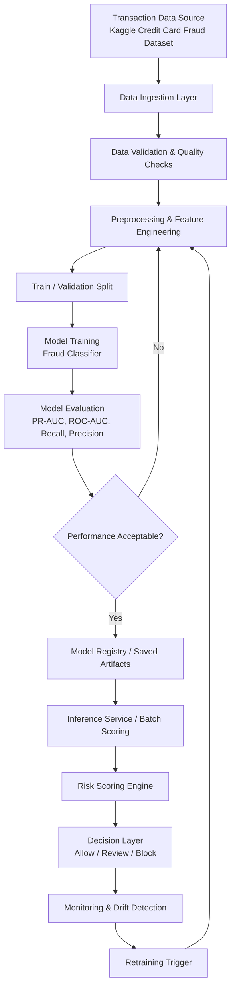

# TXGuard: AI Risk Manager and Fraud Detection for Financials

TXGuard is a Python-based fraud detection project focused on identifying anomalous and potentially fraudulent financial transactions using machine learning techniques.

## Dataset

This project uses the **Credit Card Fraud Detection** dataset from Kaggle:
- Source: https://www.kaggle.com/datasets/mlg-ulb/creditcardfraud
- Credits: Machine Learning Group - ULB

## Project Goals

- Detect fraudulent transactions with high recall while managing false positives.
- Build an interpretable and production-minded ML risk pipeline.
- Provide a modular foundation for experimentation, evaluation, and deployment.

## High-Level Architecture



## Architecture Components

### 1. Data Ingestion Layer
Loads transaction records from source files (e.g., CSV) and prepares them for downstream processing.

### 2. Data Validation & Quality Checks
Performs schema checks, missing-value audits, type consistency checks, and label distribution profiling.

### 3. Preprocessing & Feature Engineering
Handles normalization/scaling, class-imbalance strategy (e.g., weighting or resampling), and model-ready feature generation.

### 4. Model Training
Trains one or more supervised ML classifiers for binary fraud detection.

### 5. Model Evaluation
Assesses model performance with fraud-focused metrics:
- Precision
- Recall
- F1-score
- ROC-AUC
- PR-AUC
- Confusion Matrix

### 6. Model Registry / Artifacts
Stores serialized models, preprocessing transformers, configuration, and experiment metadata.

### 7. Inference Service / Batch Scoring
Runs predictions on incoming transactions (real-time or periodic batches).

### 8. Risk Scoring Engine
Converts model output probabilities into business-aligned risk scores and thresholds.

### 9. Decision Layer
Applies action policies:
- **Allow** (low risk)
- **Review** (medium risk)
- **Block** (high risk)

### 10. Monitoring & Retraining
Tracks data drift, score drift, and outcome feedback; triggers retraining when performance degrades.

## Suggested Repository Structure

```text
txguard/
├─ data/
│  ├─ raw/
│  └─ processed/
├─ notebooks/
├─ src/
│  ├─ ingestion/
│  ├─ preprocessing/
│  ├─ features/
│  ├─ models/
│  ├─ evaluation/
│  ├─ inference/
│  └─ risk/
├─ artifacts/
├─ tests/
├─ requirements.txt
└─ README.md
```

## Model Development Notes

Because fraud data is highly imbalanced, prioritize:
- Recall on the fraud class,
- Precision-recall tradeoff,
- Threshold tuning based on business cost.

## Future Enhancements

- Add explainability (e.g., SHAP) for risk decisions.
- Introduce model versioning and experiment tracking (MLflow).
- Add API serving layer (FastAPI) for real-time scoring.
- Add CI checks for data validation and model regression.

## License

Add a license file (e.g., MIT) if you plan to open-source this project.
